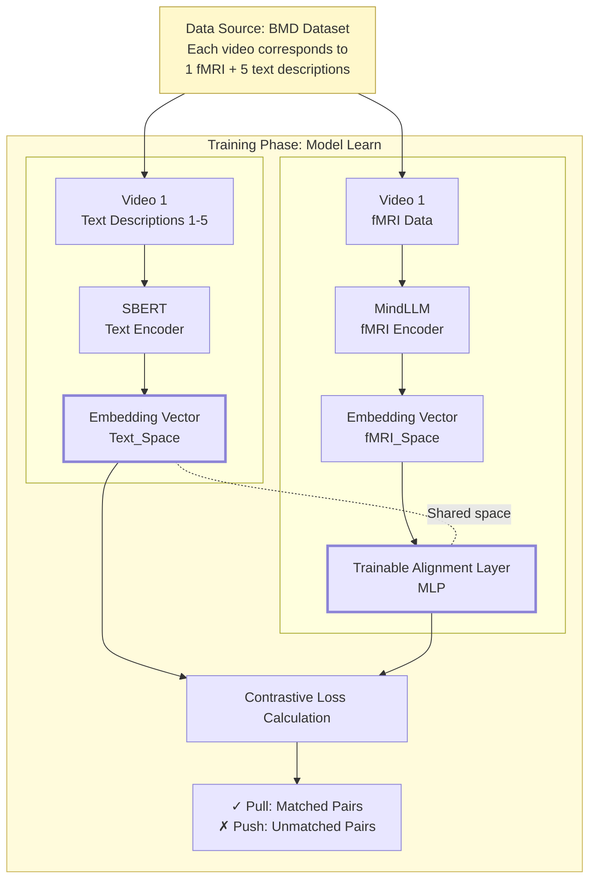
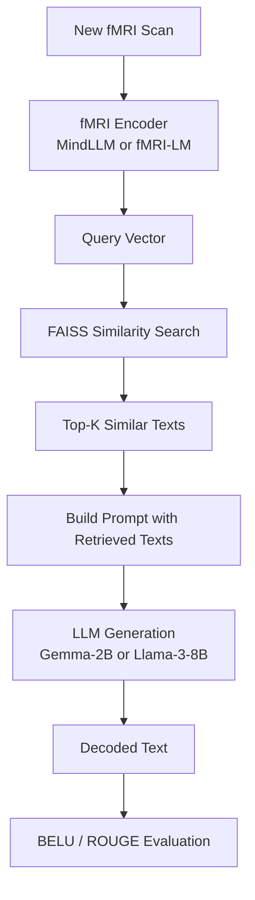
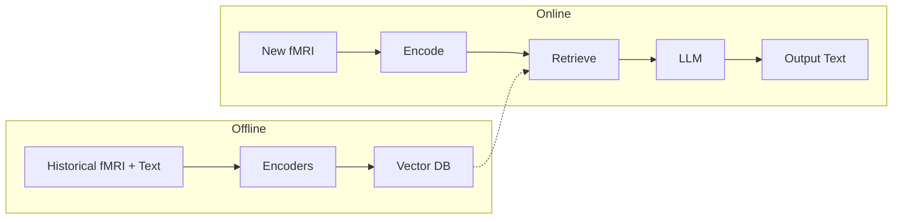

- ##  Index Building (Offline)

- ## RAG Inference (Online)

- ## Diagram 3: End-to-End Pipeline

| Component       | Model                  | Source                  |
| --------------- | ---------------------- | ----------------------- |
| fMRI Encoder    | MindLLM or fMRI-LM     | GitHub (open source)    |
| Text Encoder    | Sentence-BERT          | `sentence-transformers` |
| Vector Database | FAISS                  | `pip install faiss-gpu` |
| LLM Generator   | Gemma-2B or Llama-3-8B | HuggingFace             |
