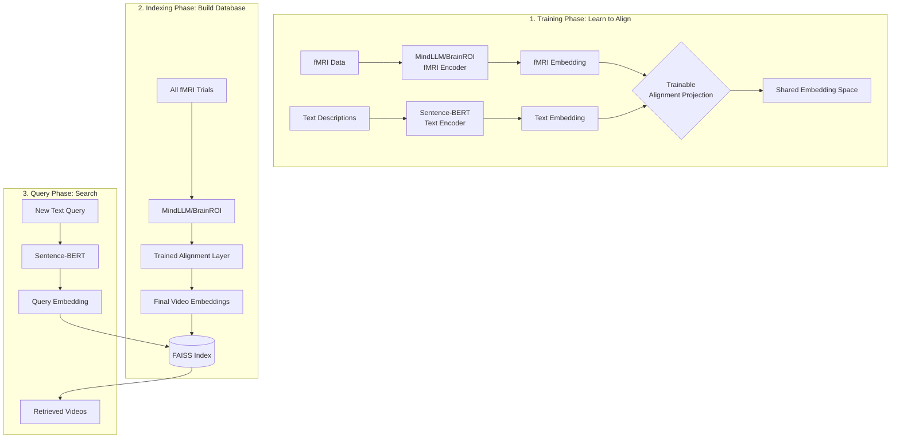
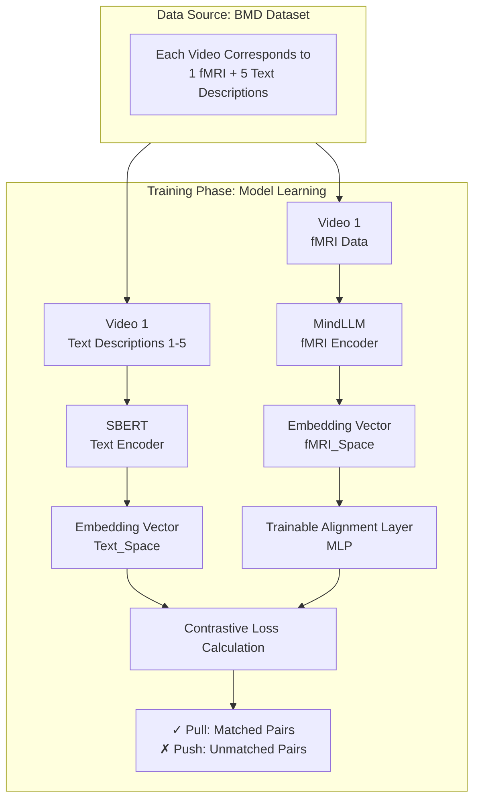

You're right to focus on the practical implementation! Yes, videos and texts can be handled by different models. The goal is to map them into a **shared embedding space** where they can be compared. This is a standard and very effective approach, similar to how CLIP works for images and text.

Here is a step-by-step guide to building your embedding database.

### 🎯 The Core Idea: A Shared Embedding Space

Think of it as creating a universal translator for your data. You will use two different "translators" (models):
1.  **Video Model**: Turns a video clip into a list of numbers (an embedding).
2.  **Text Model**: Turns a sentence into a list of numbers (an embedding).

The key is that you train or fine-tune these models so that the embedding for a video and the embedding for its matching text description end up close together in the same mathematical space.

### 🗺️ The Step-by-Step Plan

Here is how you can build this system using the BOLD Moments Dataset (BMD).

#### Step 1: Prepare Your Data
First, you need to get the two things you want to connect from BMD:
*   **The fMRI Data (as video embeddings)**: Use the prepared data in `./derivatives/versionB/`. This version is recommended because it uses a better preprocessing method called GLMsingle.
*   **The Text Descriptions**: These are in `./derivatives/stimuli_metadata/annotations.json`. Remember, each of the 1,102 videos has **five different sentence descriptions** from human annotators.

#### Step 2: Choose Your "Translator" Models
For your project, you don't need a single model to rule them all. A two-model approach is very powerful.

| Your Goal                     | Recommended Approach & Why                                                                                                                                                                        |
| :---------------------------- | :------------------------------------------------------------------------------------------------------------------------------------------------------------------------------------------------ |
| **Generate Video Embeddings** | Use a model like **MindLLM**. The model is designed specifically to take fMRI data and turn it into a meaningful, general-purpose embedding. Think of them as the "fMRI expert" in your pipeline. |
| **Generate Text Embeddings**  | Use a model like **Sentence-BERT (SBERT)**. It's a standard, high-performance model for creating embeddings that capture the meaning of entire sentences. It's the "language expert".             |

#### Step 3: Align the Embeddings (The Secret Sauce)
This is the most important step. To compare a video embedding from Model A with a text embedding from Model B, you must map them to the same space.
*   **How to do it**: Keep your chosen **fMRI encoder** (e.g., pre-trained MindLLM) and **text encoder** (e.g., pre-trained SBERT) frozen. This means you don't change their internal settings.
*   **The Alignment Layer**: Train a small, simple neural network (often just 1-2 linear layers) on top of your fMRI encoder. Your training data is the (fMRI embedding, text embedding) pairs from BMD. Use a **contrastive loss function** (like in CLIP). This loss function will learn to pull the representations of matching video-text pairs closer together while pushing non-matching pairs apart. This creates your shared space.

#### Step 4: Build Your FAISS Index
Once your alignment layer is trained, you can create your searchable database.
1.  **Process your fMRI data**: Run all your fMRI trials through your fMRI encoder and then through the trained alignment layer to get your final "video" embeddings.
2.  **Index in FAISS**: Feed these final embeddings into FAISS to build your index.

Now, to search: when you have a new text query, you turn it into an embedding using your (unchanged) SBERT model and ask FAISS to find the closest video embeddings in the index.

### 📊 Summary of the Pipeline

Here is a simple diagram of the workflow you just planned:

This approach is powerful, modular, and validated by recent research on the BOLD Moments Dataset. It lets you use the best model for each job and then intelligently connect them.

Would you like more details on the contrastive learning setup or how to structure the data loader for the alignment training step?

